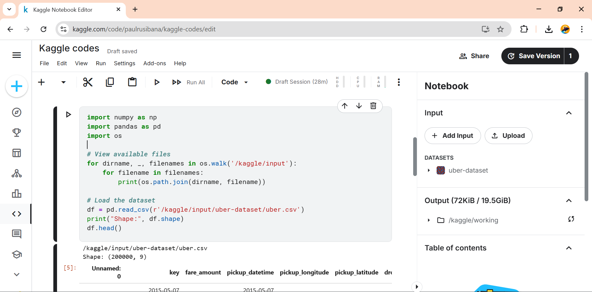
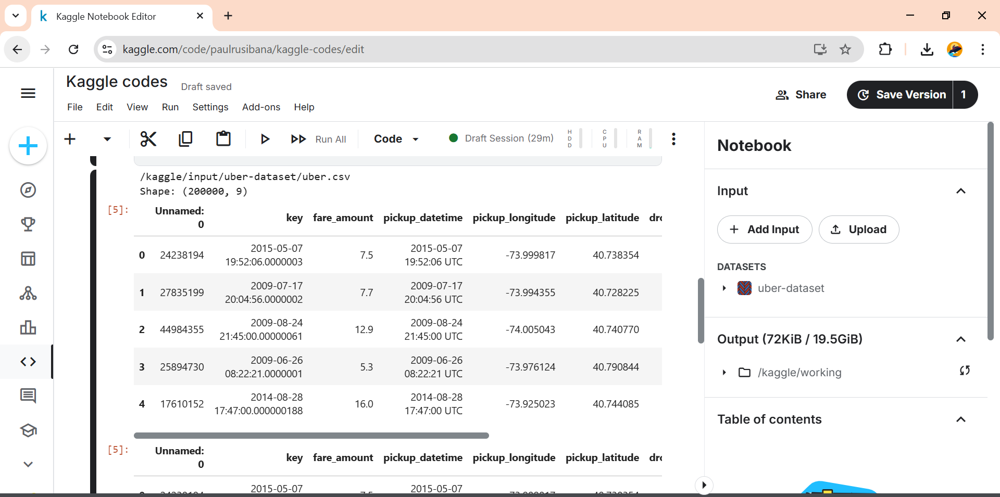
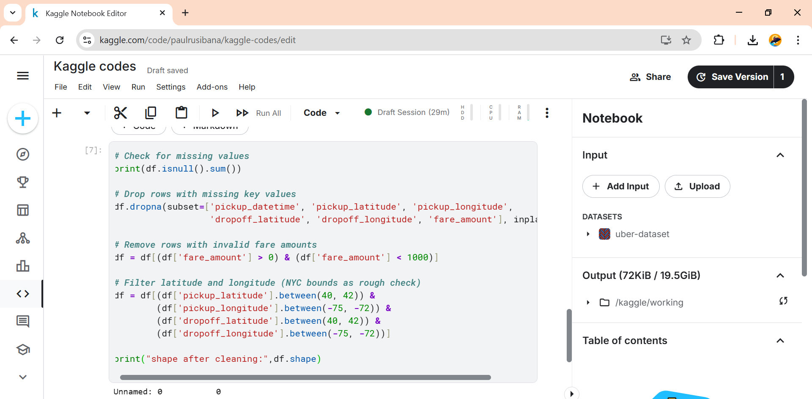
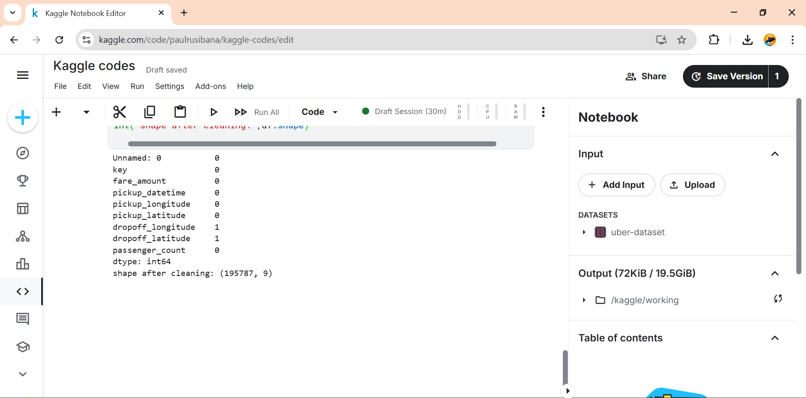
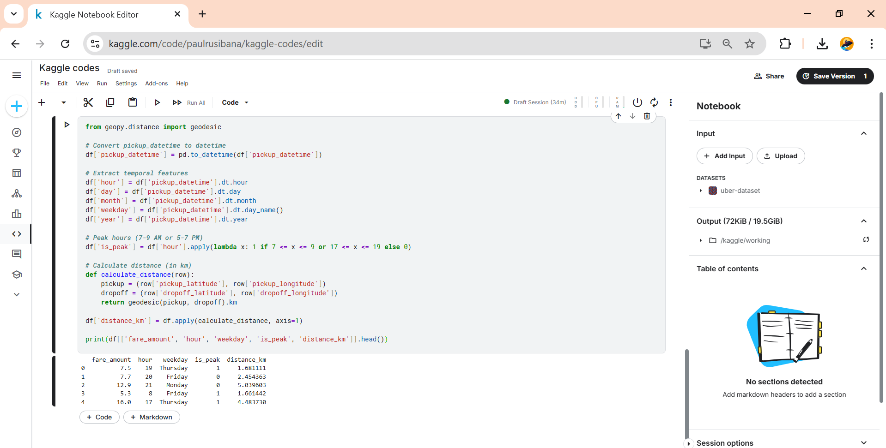
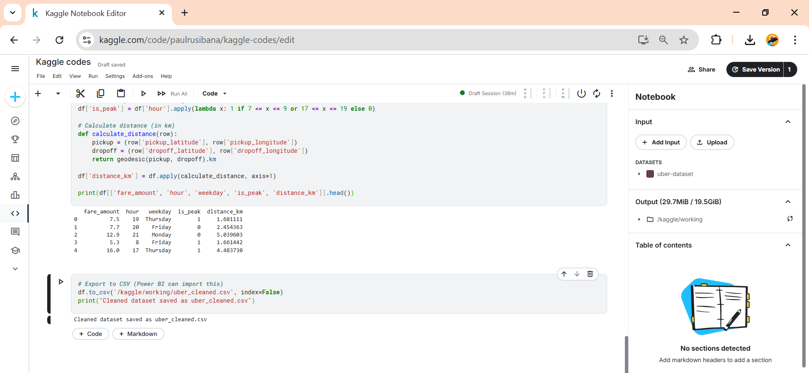
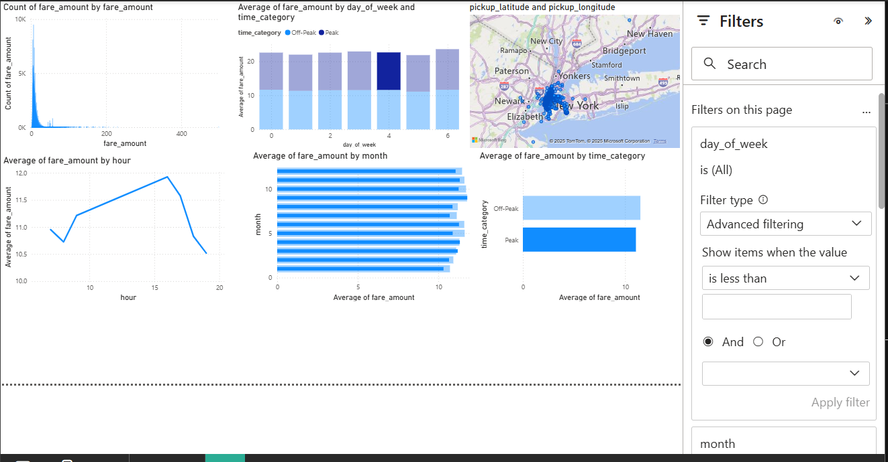

# Uber Fares Analysis Project

## 📁 Dataset

* **Source:** [Uber Fares Dataset on Kaggle](https://www.kaggle.com/datasets/yasserh/uber-fares-dataset)
* **Files Used:**

  * `uber_cleaned.csv` – cleaned data after removing nulls and invalid rows
  * `uber_enhanced.csv` – final dataset with engineered features for Power BI analysis

## 🎯 Project Objective

To analyze Uber ride fare patterns and ride trends in New York City using Python (for data cleaning and feature engineering) and Power BI (for data visualization and interactive dashboards).

---

## ⚙️ Methodology

### Step 1: Data Collection & Loading

* Loaded the dataset using `pandas.read_csv()` in Kaggle.

### Step 2: Data Types, Shape, Nulls
print(df.shape)
print(df.dtypes)
print(df.isnull().sum())
* Converted `pickup_datetime` to datetime format
* Removed rows with invalid or missing timestamps
* Checked for missing values and outliers

 

### Step 3: Feature Engineering

Created the following new features:

* `hour`, `day`, `month`, `day_of_week` from `pickup_datetime`
* `time_category`: Peak vs Off-Peak

 

### Step 4: Export Final Dataset

* Saved the enhanced dataset as `uber_enhanced.csv` for Power BI import.
* `df.to_csv('uber_cleaned.csv', index=False)`

 

---

## 📊 Power BI Visualizations

The enhanced dataset was imported into Power BI Desktop and used to create the following visualizations:

### 🔸 Fare Distribution

* Histogram showing count of rides by fare amount
* Box plot to detect outliers in fare prices

### 🔸 Time-Based Trends

* Line chart: average fare by hour of day
* Column chart: average fare by day of week
* Column chart: average fare by month

### 🔸 Peak vs Off-Peak Analysis

* Bar chart comparing average fare during Peak and Off-Peak times

### 🔸 Filters and Interactivity

* Slicers added for `month`, `day_of_week`, and `time_category`
* Full dashboard view with interactive filtering

 

---

## 📈 Insights & Findings

* **Peak Hours:** Rides between 7–9 AM and 4–7 PM have slightly higher fares
* **Day Trends:** Fares are slightly higher on weekdays compared to weekends
* **Monthly Variation:** Seasonal fare differences observed across the year
* **Outliers:** A few extremely high fares (\$400+) exist, possibly due to long trips or input errors

---

## 🧠 Recommendations

* Uber can adjust dynamic pricing based on time-of-day patterns
* Increase driver coverage during peak demand hours
* Use data to inform promotions in low-demand months or times

---

## 📎 Repository Contents

* `uber_cleaned.csv`: Cleaned version of raw dataset
* `uber_enhanced.csv`: Final dataset with added features
* `uber_dashboard.pbix`: Power BI dashboard file 
* `/screenshots/`: analysis screenshots
* `README.md`: This documentation file

---

## 👨‍🏫 Submitted For

* **Course:** INSY 8413 - Introduction to Big Data Analytics
* **Instructor:** Eric Maniraguha
* **Institution:** Adventist University of Central Africa
* **Submission Date:** July 25, 2025

---

> 📬 *Please refer to the screenshots and `.pbix` file for full dashboard visuals and analysis steps.*
